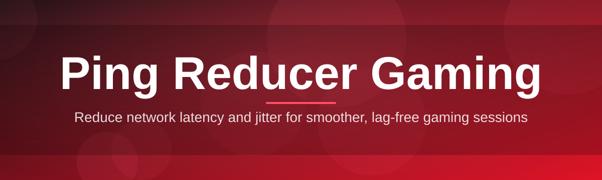
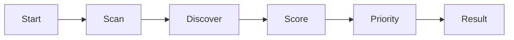

# ping-reducer-booster 🚀🎮

  

*A single-window, no-nonsense ping reducer built by a solo dev who got tired of losing gunfights to lag spikes.*

  

---

## 🧬 Overview

I started **ping-reducer-booster** on a Tuesday night after rubber-banding through an entire ranked match — you know the feeling, the enemy teleports, you die behind a wall that wasn't there a frame ago. That's not a skill issue, that's a routing issue. So instead of doom-scrolling forum threads about "best DNS for gaming" for the hundredth time, I built the tool I actually wanted: something that looks at your live network path, figures out where the jitter is hiding, and quietly nudges your traffic down a cleaner lane. No subscriptions, no telemetry harvesting, no bloated launcher — just a focused ping reducer for gaming that does one job extremely well.

This is a passion project in the truest sense. Every panel, every graph, every tiny animation in the UI was tuned by hand because I wanted opening the app to feel as satisfying as a low-ping lobby. Under the hood it's about route optimization, jitter smoothing, and packet-loss visibility — the boring-but-critical plumbing that decides whether your shots register on time. Over the past year it's grown from a personal script into something thousands of gamers now run before every session, and that still genuinely blows my mind.

Who is this for? Competitive shooter players chasing frame-perfect peeks, MMO raiders who can't afford a disconnect mid-boss-fight, and honestly anyone who's ever yelled "PING" at their monitor. If you game on Windows and you care about latency, this was built with you specifically in mind.

> [!NOTE]
> ping-reducer-booster is a network-path optimization utility. It reshapes and prioritizes *your own outgoing traffic* — it does not modify game files, servers, or anyone else's connection.

---

## ⚡ What It Actually Does

  

- **Route Sculpting** — continuously probes alternate paths to your game server's region and quietly promotes the fastest, most stable one it finds.
- **Jitter Smoothing** — instead of just showing you a scary graph of spikes, it actively buffers micro-fluctuations so your frame-to-input timing feels consistent.
- **Per-Game Profiles** — save distinct network priority profiles for each title, so your shooter settings don't clash with your MMO settings.
- **Live Latency Dashboard** — a real-time overlay-style graph of ping, jitter, and packet loss that updates every few hundred milliseconds.
- **One-Click Priority Mode** — flags your game's traffic as high priority on your local network stack so background downloads stop stealing your bandwidth mid-match.
- **Server Ping Scanner** — pings every regional server cluster for supported titles and ranks them so you always connect to the genuinely closest one.
- **Silent Background Mode** — runs minimized with near-zero resource draw, because a ping reducer shouldn't itself become the reason your FPS drops.
- **Session History Log** — keeps a lightweight local record of your ping trends over time, so you can actually see whether that ISP "maintenance window" helped or not.

> [!TIP]
> Pair **Route Sculpting** with **Per-Game Profiles** — most users see their biggest, most consistent latency improvement from that combo alone.

---

## 🧭 Getting Off the Ground

<strong>Click to expand the 4-step setup flow</strong>

1. Visit the landing page via the download button above.
2. Download the standalone `.exe` — no installer wizard, no bundled toolbars.
3. Run it. Windows SmartScreen may ask for confirmation since it's a smaller indie build — that's normal.
4. Pick your active game from the dropdown, hit **Optimize**, and drop into your lobby.

> [!IMPORTANT]
> Run the app **before** launching your game client, not after. It needs a clean baseline reading of your connection to route around problems accurately.

---

## 💻 System Requirements

| Component | Minimum | Notes |
|---|---|---|
| OS | Windows 10 (64-bit) | Windows 11 fully supported |
| RAM | 2 GB free | Runs comfortably alongside your game |
| Disk | 40 MB | Standalone binary, no dependency installs |
| Network | Any wired/Wi-Fi connection | Wired recommended for best jitter readings |
| Admin rights | Recommended | Needed for traffic priority tagging |

> [!WARNING]
> Running two network-optimization tools simultaneously (this one plus another router-QoS app, for instance) can fight over the same priority rules and cause *worse* jitter, not better. Pick one.

---

## 🛰️ How It Works

The whole pipeline is intentionally simple to reason about — no black-box magic, just a clean loop:

1. **Baseline Scan** — measures your current ping, jitter, and loss to your chosen server region.
2. **Path Discovery** — probes a handful of alternate route candidates in parallel.
3. **Scoring** — ranks each candidate route by stability, not just raw speed.
4. **Priority Tagging** — marks your game's outbound packets as high priority locally.
5. **Live Monitoring** — keeps re-scoring in the background and re-routes if conditions shift.

---

## 🩹 Troubleshooting

<strong>My ping dropped a little but not dramatically — is that normal?</strong>

Yes. Route Sculpting reduces jitter and instability more reliably than it shaves raw milliseconds. If your baseline ping is already low, expect a smoother line on the graph rather than a huge number drop.

<strong>The app says "No improved route found" — what now?</strong>

This usually means your ISP path is already close to optimal for that server. Try switching the target region if your game supports it, or check your household bandwidth usage in the background.

<strong>Does this work with wireless controllers or console play?</strong>

No — this is a Windows PC network utility. It optimizes your PC's outbound traffic, so it won't affect console-side connections.

<strong>SmartScreen flagged the download, is that expected?</strong>

Yes, it's common for smaller indie tools without a massive code-signing budget yet. Verify you downloaded from the official landing page and proceed normally.

<strong>Can I run this on a laptop with battery saver on?</strong>

You can, but battery saver modes often throttle background network processes, which weakens the live monitoring loop. Plugged-in mode is recommended during ranked sessions.

---

## 🎨 UI, UX & Shortcuts

The interface is deliberately minimal — one main window, one settings drawer, zero clutter.

| Shortcut | Action |
|---|---|
| `Ctrl + O` | Trigger a fresh Optimize scan |
| `Ctrl + D` | Toggle the live latency Dashboard |
| `Ctrl + P` | Switch active Game Profile |
| `Ctrl + M` | Minimize to system tray (Silent Mode) |
| `Ctrl + H` | Open Session History log |
| `Ctrl + ,` | Open Settings panel |
| `Esc` | Cancel an in-progress scan |

**Themes:** Midnight (default dark), Slate, and a high-contrast Arena theme for streaming overlays.

**Settings highlights:**

- Auto-launch on Windows startup
- Auto-select "closest region" on app open
- Adjustable scan interval (5s–60s)
- Optional tray-only launch

---

## 🤝 Contributing & Community

This started as a one-person project and it stays friendly precisely because of that spirit. Bug reports, UI polish ideas, and profile suggestions for niche titles are always welcome via Issues.

> [!TIP]
> The most useful contributions right now aren't code — they're real-world latency logs from different regions and ISPs. That data directly shapes future route-scoring tweaks.

- Open an Issue for bugs or feature requests
- Star the repo if it saved your lobby
- Share your before/after latency graphs — it genuinely motivates continued development

---

## 📜 License

Released under the [MIT License](LICENSE), 2026. Use it, learn from it, build on it.

---

## ⚠️ Disclaimer

ping-reducer-booster optimizes your own local network path and traffic prioritization settings. It does not guarantee specific ping numbers, does not interact with game servers directly, and results vary based on your ISP, hardware, and regional infrastructure. Use responsibly and in accordance with your game's terms of service.

